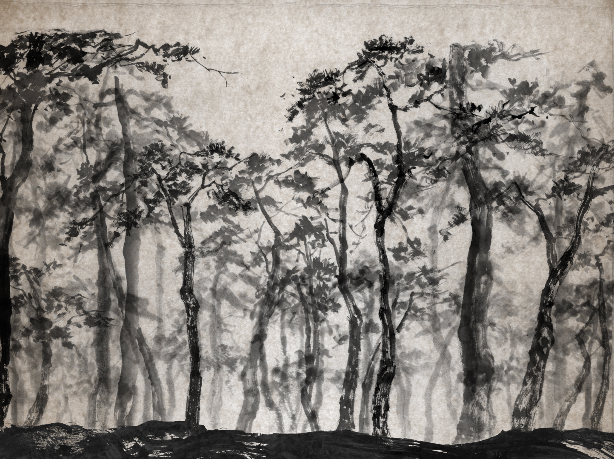
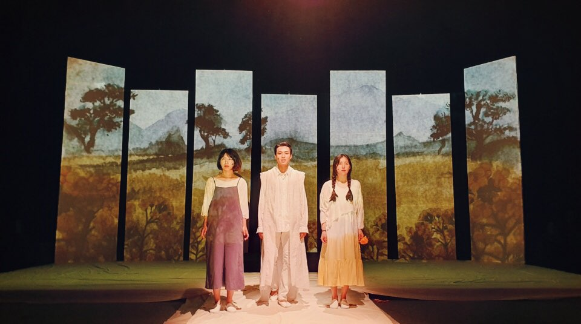
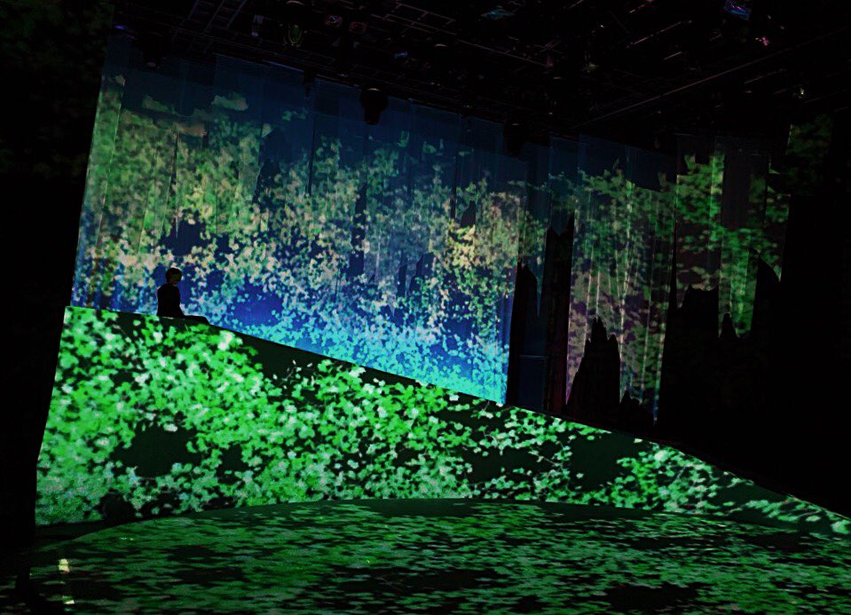
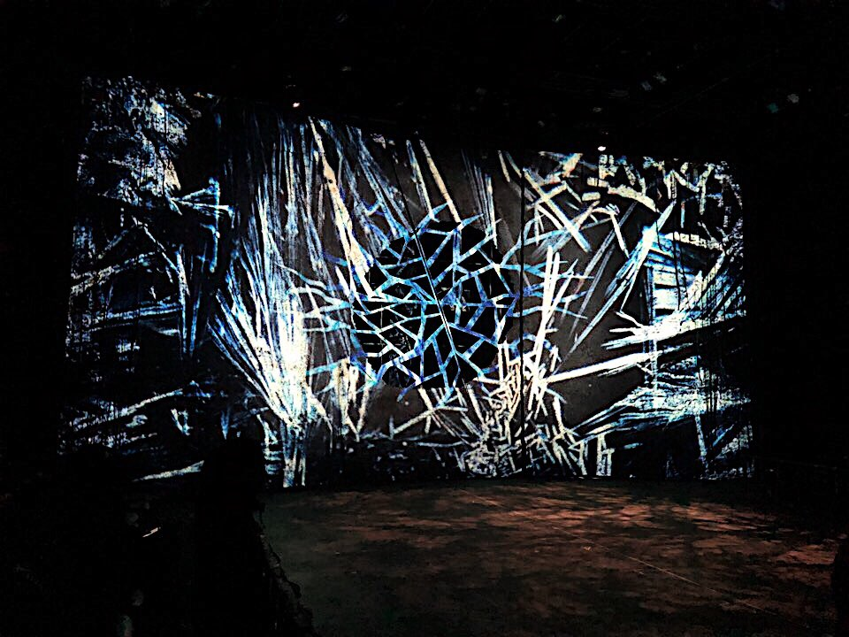
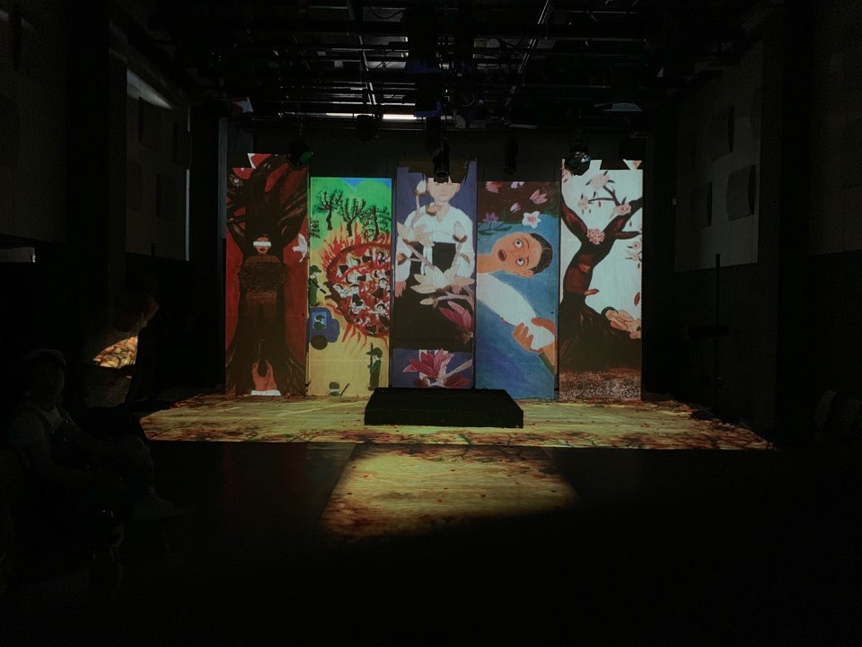

## My GitHub Page

접속 주소 : <http://Junghyunhee.github.io/PoeticCodeForNature/>

## JungHyunHee

## PORTFOLIO
 * Graphic
 
 
 
 
 
 
 
 

 * Projection Mapping
  
   
   
    
     
      
       
        

## 기말작엄
  * [예시 작업](./example/)
