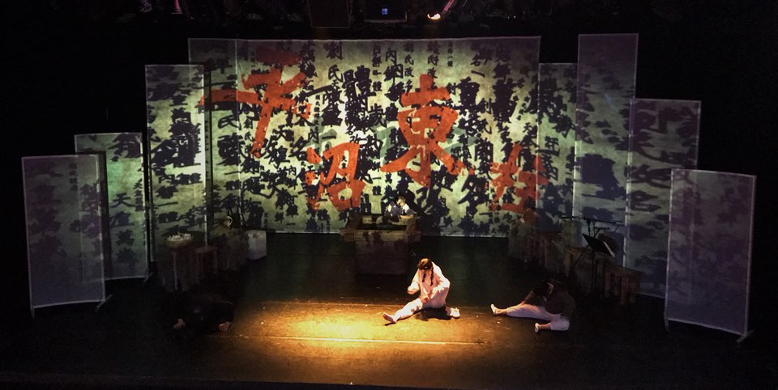
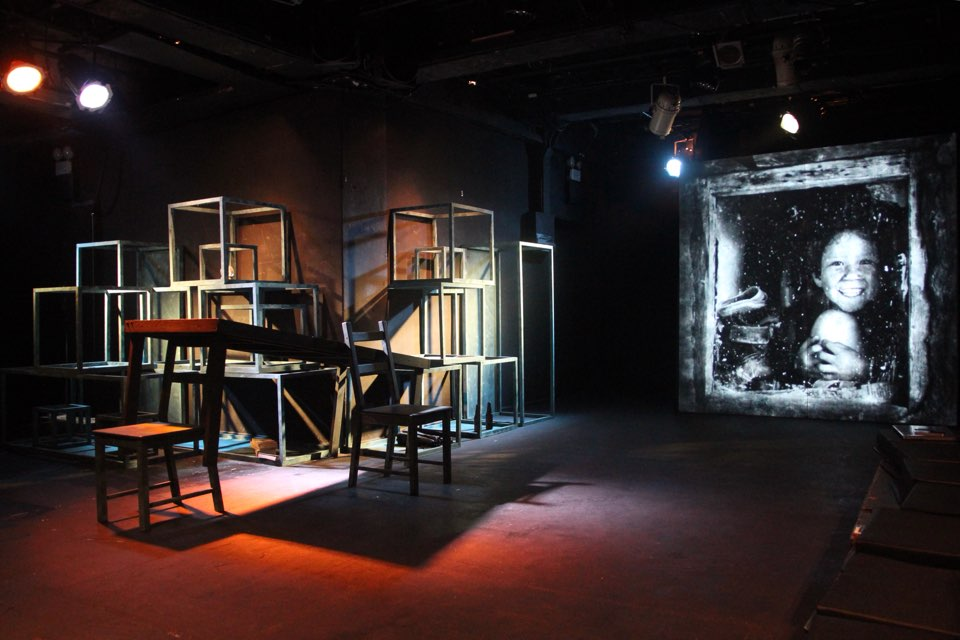

## My GitHub Page

접속 주소 : <http://Junghyunhee.github.io/PoeticCodeForNature/>

## JungHyunHee

## PORTFOLIO
 * Graphic
 
 
 
 
 
 
 
 

 * Projection Mapping
  
   
   
    
     
      
       
        

## Final Project 1

  * [편식하지 말라곰!](./1/)
  * 곰을 좌우로 움직여 보세요!
## Final Project 2

  * [나를 따라와 보라공!](./2/)
  * 가운데 빨간 버튼을 클릭한 뒤 움직여 보세요!
## Final Project 3

  * [예시 작업](./3F/)
  * 마우스를 클릭하면 공이 터져요!
  * 공들이 벽에 부딪히면 검은색으로 변한답니다.
